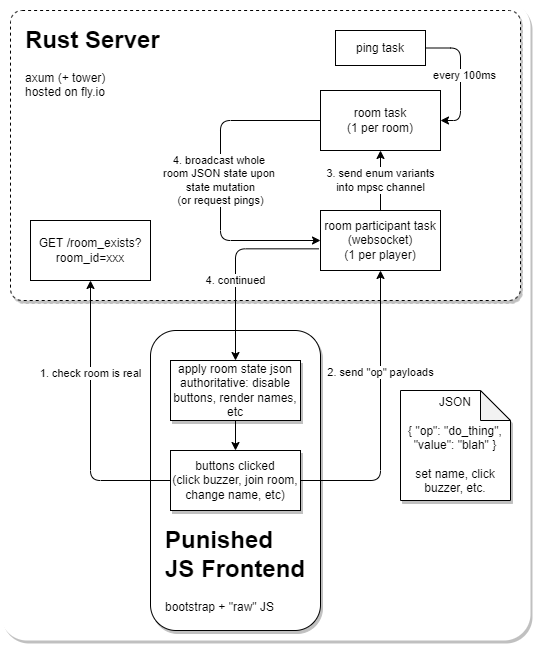

# Buzzer Overview

This is a simple all-in-one, self-contained, shared-state buzzer toolkit.

All it needs to do is run and have network I/O, and preferably with HTTPS termination.

`$ cargo run` is all you need, it's currently hard coded to listen on port 7777.

## Video Demonstration
https://user-images.githubusercontent.com/240875/201868226-a097d670-e735-4844-87ec-71134a5a6faf.mp4

## Features

* Room creator is the "room captain" and is the only one who can reset buzzers, lock them, etc.
* Room creator can set the room to one of two modes:
  * First To Buzz - all buzzers lock once 1 buzzer is hit, no more buzzers can be pressed until they're unlocked and reset.
  * Buzzer Race - all buzzers can be pressed in any order, the order they are pressed in will be displayed.
* Join a room with your friends!
* Hit the buzzer button!
* That's about it!

Future TODOs if this ever grows legs:
* Let room captains promote other members to room captain (maybe even a co-captain?)
* Allow captains to set or award scores
* More elaborate modes with complex state (ie: an actual Jeapordy style mode with a grid and rounds and timers etc)

## This Ain't Pretty!
In it's current form, this repo is a super quick and dirty personal weekend hackathon with no unit tests and very little refactoring or cleanup in two languages I don't get to use very often. You'll note there are many crimes here, such as:
* One huge JS blob in the .html that is the clientside game state
* One huge rust main.rs that is the serverside game state.
* No tests!! None! No TDD! No nothing!

Needless to say if ever this demands any more complexity, it'll be worth it to do a big refactoring cleanup, get code coverage going, etc. Rust and javascript programmers alike: turn back, this is not a place of honor.

As it stands, however, I don't think this will need much additional features and can languish in perpetuity as a little hack job that serves it's purpose.

# Structure

This architecture stands on three important "keepin' it simple" legs:
1. Almost all events flow to/from the client and server effectively flow in 1 very static cycle.
2. All room state is fully public.
3. Single server architecture, no matchmaking, token based server-routing, state-sharing fabric (redis/sql/whatever). Just one little server doing as much as it can (or bust).

## Diagram

